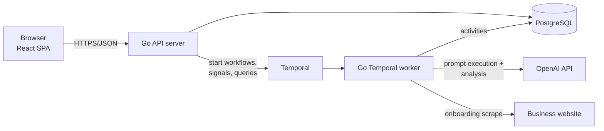

# Design 01 — Architecture Overview

Depends on: [PRD](../prd.md)

## Goals and constraints

- Solo builder/operator: minimize moving parts and ops burden. Prefer boring, managed, one-binary-where-possible.
- **Low running cost**: target a single modest VPS for the whole stack until revenue justifies more.
- Multi-tenant SaaS from day one.
- MVP scale envelope: Starter plan = 20 prompts × 1 run/week per tenant. Even at 500 tenants that is ~10k LLM calls/week — load is trivial; the design optimizes for **correctness, auditability, and iteration speed**, not throughput.
- Every user-facing metric must link back to a stored raw response (PRD §6), so raw data retention is a first-class concern.

## Decision summary

| # | Decision | Choice |
|---|----------|--------|
| D1 | ChatGPT data source | OpenAI Responses API + `web_search` tool |
| D2 | Backend | Go monolith (API server + Temporal worker) |
| D3 | Frontend | React SPA (Vite), talks to Go API |
| D4 | Database | PostgreSQL — single instance, `tenant_id` scoping |
| D5 | Orchestration | Temporal, **self-hosted single node** on the VPS |
| D6 | Analysis LLM | OpenAI (structured outputs) for MVP — one vendor, one key; keep behind an interface |
| D7 | Repo layout | Monorepo |
| D8 | Deployment | Single VPS, Docker Compose |

## D1 — ChatGPT data source

We use the OpenAI Responses API with the `web_search` tool as a **proxy for consumer ChatGPT**. It is ToS-compliant, stable, and returns citations natively (URL annotations), which maps directly to the PRD's citation-source feature.

Honest limitation, to be reflected in product copy: results approximate, but are not identical to, what a logged-in chatgpt.com user sees (no memory/personalization, possibly different model routing). We record the exact model ID with every run (PRD §5 requires it) so results stay interpretable as models change.

The executor is defined behind a Go interface (`PromptRunner`) so future platforms (Gemini, Perplexity — PRD §9) are additive, not rewrites.

## D2/D3 — Application shape



One Go module, two run modes (`serve` and `work`) from the same binary — deployable as one process in dev, two containers in prod. Shared domain and persistence packages; no internal RPC between API and worker — they share the database and communicate through Temporal.

- **API server**: HTTP/JSON (chi router; plain REST — no gRPC/Connect for MVP), auth middleware, tenant scoping.
- **Worker**: hosts all Temporal workflows/activities: onboarding profile generation, weekly monitoring runs, analysis.
- **Frontend**: Vite + React + TypeScript SPA. Five sections per PRD §7. Served as static files from the Go binary (no separate web server to run).

## D4 — Data storage

A single Postgres instance holds everything, as three databases:

- `opensight` — application data: tenants, business profiles, prompts (with replacement lineage), runs, raw responses, mentions, citations, competitors.
- `temporal` — Temporal's core persistence store (see D5).
- `temporal_visibility` — Temporal's visibility persistence store.

Sharing one instance is a deliberate cost call: Temporal's "dedicated persistence" guidance targets high-throughput clusters, not thousands of activities/week. Guardrails: cap Temporal's connection pool (~20) and size `max_connections` for both consumers; check Temporal's Postgres compatibility before major PG upgrades. If it ever hurts, migration is dump/restore of the `temporal` database to a new instance — no code changes.

Raw LLM responses are stored as `jsonb`/text in Postgres rather than object storage — at ~20 responses/tenant/week the volume is small, and keeping raw + derived data in one place makes "every metric links to the response" trivial (joins, not cross-store lookups).

Multi-tenancy: shared schema, `tenant_id` column on every tenant-owned table, enforced in a repository layer (not RLS, for MVP simplicity).

## D5 — Temporal usage

Temporal is the backbone for everything asynchronous:

- **Weekly monitoring**: one Temporal Schedule per business → `WeeklyRunWorkflow` fans out 20 `ExecutePrompt` activities with per-activity retries; partial failure yields per-prompt run status (PRD §5) instead of an all-or-nothing batch.
- **Onboarding**: `GenerateProfileWorkflow` (scrape site → LLM proposal → persist as draft for user review).
- **Analysis**: runs as a second phase of the weekly workflow (mentions, sentiment, keywords, competitors), so a failed analysis can retry without re-spending prompt executions.

### Hosting: self-hosted single node

Temporal Cloud's ~$100+/month floor is not justified at MVP scale. We run the Temporal server as a **single Docker container backed by the shared Postgres instance**, with schemas initialized explicitly by a one-shot `temporalio/admin-tools` container, plus the Temporal UI container for debugging. At our load (thousands of activity executions/week) this comfortably fits in ~1GB of RAM alongside the app.

Accepted trade-offs, all acceptable for a weekly-cadence product:

- We own upgrades (pin versions, upgrade deliberately).
- If the VPS is down, schedules pause and fire when it returns — a late weekly run is invisible to users.
- The `temporal` database must be included in backups with the same rigor as the app database: it holds all schedules and in-flight workflow state.

Migration path to Temporal Cloud later is configuration (endpoint + mTLS certs), not code.

## D7 — Repo layout

```
opensight/
├── cmd/opensight/        # single binary: serve | work | migrate
├── internal/
│   ├── api/              # HTTP handlers, middleware
│   ├── auth/             # password hashing (shared by api + user-create CLI)
│   ├── domain/           # core types, business logic
│   ├── store/            # Postgres repositories, migrations
│   ├── workflows/        # Temporal workflows + activities
│   └── llm/              # PromptRunner + analysis interfaces, OpenAI impl
├── web/                  # Vite + React SPA
└── docs/
```

## D8 — Deployment

A single **Hetzner VPS** running Docker Compose: `app` (serve), `worker` (work), `postgres`, `temporal`, `temporal-ui`, and Caddy (or similar) for TLS. Total footprint fits ~4GB. Hetzner's Singapore location is a nice-to-have for the target market. The Compose setup is provider-agnostic, so this is reversible. Nightly `pg_dump` of both databases shipped off-box. Remaining details (backup destination, secrets) land in the cross-cutting doc.

## Out of scope for MVP (explicit)

- Billing/payments — but the design must stay **billing-ready**: tenants reference a plan row carrying entitlements (prompt limit, run frequency, platforms) instead of hardcoding "20 prompts, weekly" anywhere. MVP ships with a single "starter" plan row; adding Stripe later is webhook → change tenant's plan → entitlements take effect. This is a hard requirement on the 02 data model.
- Platforms beyond ChatGPT; daily monitoring; alerts (PRD §9).
- RLS / per-tenant databases; horizontal scaling concerns.

## Open questions (owned by later increments)

- **02 Data model**: exact prompt-replacement lineage model; mention/citation schemas.
- **03 Onboarding**: how the site scrape works (fetch + LLM vs. search-augmented); draft/confirm state machine ("confirmed values are never auto-overwritten").
- **07 Cross-cutting**: auth provider (managed vs. hand-rolled sessions), VPS provider, backup destination, secrets, observability.
