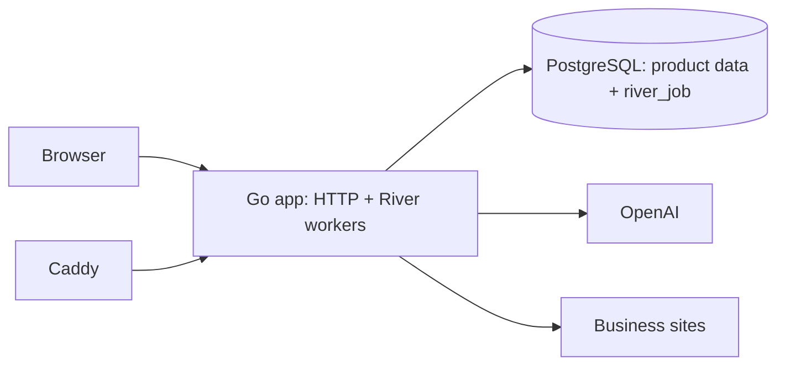

# Design 01 — Architecture

Depends on: [PRD](../prd.md)

OpenSight is one Go process (`opensight serve`) with an embedded React SPA. It serves HTTP and runs River OSS workers against the same PostgreSQL database. OpenAI Responses supplies monitoring and analysis data; Stripe owns billing; Caddy terminates TLS.



PostgreSQL is the durable source of truth. River supplies job persistence, dispatch, retries, uniqueness, and cancellation in the application database; it is not a separate service. Application migrations run first and River's bundled migrations run second through `opensight migrate`.

The production job package has five coarse jobs:

- scheduler sweep;
- onboarding profile generation;
- monitoring;
- analysis;
- assessment publication.

Coarse jobs recover through idempotent database checkpoints. Monitoring records one immutable result per prompt, analysis overwrites rebuildable derived rows, and assessment publishes the new audit/findings atomically. One process-wide `LLM_CONCURRENCY` limiter, default `2`, covers both jobs and synchronous question generation.

`serve` starts River before accepting HTTP. Shutdown stops HTTP, stops job fetching, allows a 30-second soft drain, then cancels remaining job contexts so River can retry them after restart. Multiple identical app instances remain possible because River coordinates work in PostgreSQL.

Production is a single OVHcloud VPS running `app`, PostgreSQL, and Caddy with Docker Compose. Backups cover the `opensight` database, which includes both product and River state.

Repository layout:

```
cmd/opensight/       CLI and unified server
internal/api/        Connect RPC and HTTP
internal/jobs/       River args, schedules, and workers
internal/store/      PostgreSQL repositories and migrations
internal/workflows/  idempotent application operations used by jobs
internal/llm/        provider adapters and shared limiter
web/                 embedded React SPA
infra/               Ansible and production Compose
```
