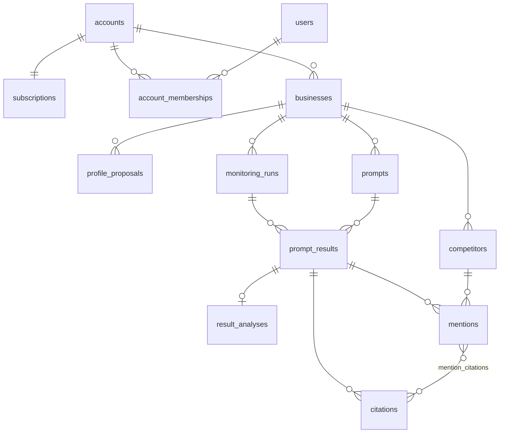

# Design 02 — Data Model

Depends on: [01 Architecture](01-architecture.md) (Postgres, account scoping, billing)

## Principles

- **Immutable facts, derived insights.** Prompt executions and raw responses are append-only. Everything the user sees (visibility %, sentiment, competitor stats) is derived from them and can be recomputed. Analysis tables can be wiped and rebuilt; results tables cannot.
- **New measurement = new identity.** A prompt's text is immutable. Changing it creates a new prompt row — that is what makes "replacement starts a new trend, old history remains" (PRD §4) fall out of the schema instead of being special-cased.
- **Entitlements over constants.** Nothing reads a bare "20" or "weekly" at a use site; limits come from the account's plan entitlements, resolved through `subscriptions.plan_code` against the plan catalog (08).
- **No pre-aggregation.** At ≤20 results/business/week, every chart is a live query. Rollup tables are a future optimization, not a schema concern.

## Entity overview



All IDs are UUIDv7 (time-ordered, index-friendly). `account_id` lives on `businesses`; deeper tables scope through their business join — the repository layer always enters through an account-checked business lookup. Callers without ambient account context (Temporal activities, CLI) first resolve the business's account via a single bootstrap lookup (`store.Store.ResolveAccountID`), then use the same account-checked repositories.

All application and metrics statements are named sqlc queries in the unified
`internal/store/queries/` catalog. Generated row types stay inside the
persistence/metrics adapters; public repository types express domain meaning
and preserve account-scoping and sentinel-error contracts. Optional result
filters are one static query using nullable parameters and an ID array, so no
runtime SQL assembly is needed.

## Tables

### Accounts, identities, memberships, and subscription

```sql
accounts ( id uuid PK, name text, slug text UNIQUE, created_at )
users    ( id uuid PK, email citext UNIQUE, google_sub text UNIQUE NULL, created_at )

account_memberships (
  account_id uuid FK REFERENCES accounts(id) ON DELETE CASCADE,
  user_id    uuid FK REFERENCES users(id) ON DELETE CASCADE,
  role       text CHECK (role IN ('owner', 'admin', 'member', 'viewer')),
  created_at timestamptz,
  PRIMARY KEY (account_id, user_id)
)
-- index on (user_id, account_id) supports account listing for a signed-in user
-- auth mechanics (Google sign-in/sessions) owned by design 07

subscriptions (
  account_id             uuid PK FK,   -- one permanent billing record per account
  plan_code              text,         -- 'starter' — resolves against the code catalog (08)
  stripe_customer_id     text UNIQUE NULL,
  stripe_subscription_id text UNIQUE NULL,
  stripe_status          text NULL,    -- verbatim Stripe status; never invented locally
  past_due_since         timestamptz NULL,  -- bounds how long dunning retains access (08)
  comped                 boolean,      -- operator-granted access, no Stripe objects
  current_period_end     timestamptz NULL,
  cancel_at_period_end   boolean,
  created_at, updated_at
)
```

**There is no `plans` table.** Entitlements — prompt limit, run interval, platforms — are a versioned catalog in code (design 08), because a limit and the Stripe Price it is sold against must ship as one unit rather than as two independently seeded systems. The database stores only what code cannot: this account's Stripe state. `plan_code` is the join between them, and an unknown code is an error, never a silent default.

A user is one global identity and may have memberships in multiple accounts with a different role in each. Membership grants access to every business in the account; business-specific ACLs are deferred. Accounts may have multiple owners, but the application locks the account row and rejects any owner removal or demotion that would leave no owner.

### Businesses and profile

```sql
businesses (
  id UUID PK, account_id FK, status text,   -- 'draft' | 'active'
  name text, website text,
  aliases text[],     -- organization trading names ONLY; never a person's name unless
                      -- it is genuinely part of the trading identity
  category text,
  services jsonb,
  location jsonb,     -- { address, area, city, country } — country is required;
                      -- monitoring derives web_search user_location from this (04)
  created_at, activated_at
)

profile_proposals (
  id UUID PK, business_id FK,
  payload jsonb,            -- full proposed profile + proposed prompts (+ optional informational sources)
  status text,              -- 'pending' | 'applied' | 'discarded'
  created_at, resolved_at
)
```

The PRD's "confirmed profile values are not overwritten automatically" is enforced structurally: **generation only ever writes `profile_proposals`**; values reach `businesses` through the user-driven onboarding apply step or an explicit post-activation Setup edit. Setup updates only profile columns and never changes lifecycle, plan, prompts, runs, or derived history. There is no code path where the pipeline writes business columns directly. (Onboarding flow details: design 03.)

MVP has one business per account. The account remains distinct because it owns billing and memberships; a business is the monitored real-world organization.

### Prompts

```sql
prompts (
  id UUID PK, business_id FK,
  text text,                          -- immutable after insert
  status text,                        -- 'active' | 'retired'
  replaces_prompt_id uuid FK NULL,    -- lineage link for the UI
  created_at, retired_at
)
```

- Invariant (app-enforced): `count(active) <= plan.prompt_limit`.
- Edit and replace are the same operation: retire the old row, insert a new one with `replaces_prompt_id` set. The confirmation warning (PRD §4) is a UI concern; the schema makes the consequence real — a new `prompt_id` means charts naturally start a fresh series, while the retired prompt's results remain queryable through its id.

### Runs and results (the append-only core)

```sql
monitoring_runs (
  id UUID PK, business_id FK,
  platform text,               -- 'chatgpt'
  trigger text,                -- 'initial' | 'scheduled' | 'manual'
  scheduled_for date,          -- the week this run represents
  status text,                 -- 'running' | 'completed' | 'partial' | 'failed'
  workflow_id text,            -- Temporal handle for debugging
  started_at, completed_at,
  analysis_completed_at timestamptz NULL,  -- set when reconcile commits (05);
                                           -- the "analyzed" gate for all metrics
  expected_results int NULL,   -- prompt-snapshot size at run start; the "N" in "k of N"
                                -- (nullable, no backfill — null means "unknown", not zero)
  UNIQUE (business_id, platform, scheduled_for)   -- idempotency anchor for the workflow
)

prompt_results (
  id UUID PK, run_id FK, prompt_id FK,
  status text,                 -- 'succeeded' | 'failed'
  model text,                  -- exact model id reported by the API
  request jsonb,               -- what we asked: model, user_location, tool config (04)
  raw_response jsonb,          -- full Responses API payload (citations included)
  response_text text,          -- extracted answer text, for display + analysis
  error text NULL,
  requested_at, completed_at,
  UNIQUE (run_id, prompt_id)   -- retries can never create duplicate results
)
```

This pair is the PRD §5 storage list verbatim. `raw_response` keeps the untruncated API payload so any future analysis (or bug fix) can rerun from source. A run whose prompts partially fail is `partial` — visibility math uses only `succeeded` results ("percentage of **valid** responses", PRD §6).

### Analysis (derived, rebuildable)

```sql
result_analyses (                     -- sentiment/keywords ONLY; mention facts live
                                      -- exclusively in mentions (canonical, below)
  prompt_result_id uuid PK FK,
  sentiment text NULL,                -- 'positive'|'neutral'|'negative'|'mixed'; NULL if not mentioned
  keywords text[],
  excerpts jsonb,                     -- supporting quotes for sentiment/keywords
  analysis_model text,
  extraction_version int,             -- version of the extraction prompt; enables
                                      -- targeted re-analysis after prompt changes
  analyzed_at
)

competitors (
  id UUID PK, business_id FK,
  name text, website text NULL,
  aliases text[],              -- approved matching keys (exact pass, 05)
  suggested_aliases text[],    -- LLM-proposed variants awaiting user approval (05/06)
  source text,                 -- 'discovered' | 'manual'
  status text,                 -- 'discovered' | 'tracked' | 'dismissed'
  created_at
)

mentions (
  id UUID PK, prompt_result_id FK,
  subject text,                -- 'self' | 'competitor'
  competitor_id uuid FK NULL,  -- required iff subject = 'competitor'
  matched_by text,             -- 'exact' | 'llm' — how the name matched (see 05)
  mention_order int,
  verbatim_name text,          -- exact organization text extracted from the response
  excerpt text
)

citations (
  id UUID PK, prompt_result_id FK,
  url text, domain text, title text NULL,
  cite_order int,              -- unique per result; how a mention resolves its citation
  subject text,                -- 'business' | 'competitor' | 'other' | 'unknown' (best-effort)
  text_start int, text_end int -- the part of response_text this citation backs (05)
)

mention_citations (
  mention_id uuid FK REFERENCES mentions(id) ON DELETE CASCADE,
  citation_id uuid FK REFERENCES citations(id) ON DELETE CASCADE,
  PRIMARY KEY (mention_id, citation_id)
)
```

- **`mentions` is canonical — the only source of mention facts**. Self-visibility, mention order, and every PRD §6 competitor metric (mention %, totals, average order, per-prompt appearances, trend) are aggregates over it; `result_analyses` never answers "was X mentioned". A result enters the metrics base only when its run's `analysis_completed_at` is set **and** it has a `result_analyses` row — unanalyzed results are excluded from numerator and denominator alike (badged in the UI, 06). Dismissed competitors keep their mention rows (dismissal is a display filter, so re-tracking restores history).
- Discovery inserts `competitors` with status `discovered`; the extraction pipeline (design 05) matches names against `competitors.aliases` before creating new rows.
- Editing `competitors.aliases` changes matching keys for future reconcile passes only. It does not rewrite `suggested_aliases`, prior mentions, or any historical metric.
- `citations.subject` is best-effort inference from the response context, not from fetching cited pages; `unknown` is an honest value. Fetching cited pages to verify is a possible later enhancement, noted in design 05.
- `mention_citations` stores the extraction model's direct many-to-many links between entity mentions and citation occurrences. One citation may support several organizations and one organization may have several citations; no row means the relationship was unclear or the citation expressed general guidance. Anything asking which businesses a source supported must read this link — the answer-level set is every business the response mentioned, which is a different and much larger question.

## How the PRD's metrics map to queries

| PRD metric | Query shape |
|---|---|
| Visibility % (week) | self-mentions ÷ analyzed results in that run |
| Weekly trend | same, grouped by `monitoring_runs.scheduled_for` |
| Prompt presence/absence | latest analyzed result per active prompt, joined to `mentions` |
| Mention order | `mentions.mention_order` where `subject = 'self'` |
| Sentiment/keywords over time | `result_analyses` grouped by run week |
| Citation frequency | `citations` grouped by domain |
| Competitor comparison | `mentions` grouped by `competitor_id` vs `subject='self'` |

Every row above carries `prompt_result_id`, satisfying "every metric links to the underlying response."

## Retention

Indefinite. Historical results are the product; at this volume (a few MB/account/year) deletion is a non-feature until legal/privacy requirements say otherwise.

## Open questions (owned by later increments)

- **03**: exact `profile_proposals.payload` shape and the review/apply UX contract.
- **05**: alias-matching rules (clinics have many name variants); whether sentiment/keyword extraction is one LLM call per result or batched per run.
- **07**: users/auth columns beyond the minimal sketch.
