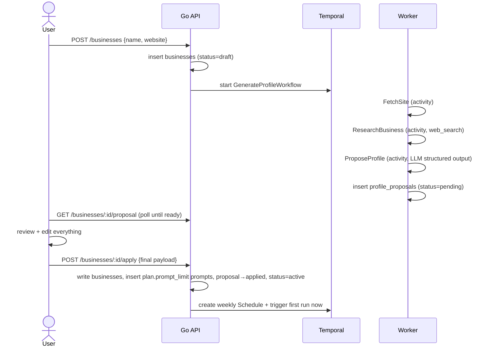

# Design 03 — Onboarding Pipeline

Depends on: [01 Architecture](01-architecture.md), [02 Data Model](02-data-model.md) (`businesses`, `profile_proposals`, `prompts`)

## Flow



Generation is chained LLM work (web_search + a structured-output call, each with a validation retry), so end-to-end runtime is on the order of a few minutes, not seconds. GenerateProfileWorkflow runs to completion with no fixed deadline; the UI polls proposal status and shows progress rather than assuming a fixed budget.

## GenerateProfileWorkflow

Three activities, each independently retryable:

1. **FetchSite** — plain HTTP GET of the homepage plus obvious high-value paths (`/about`, `/services`, `/team`, `/doctors`, `/contact`, and anything linked from the homepage nav; sitemap.xml if present). HTML stripped to text, capped (~50KB total). **No headless browser in MVP** — clinic sites that render nothing without JS fall back to step 2 alone. Fetching is SSRF-guarded: http(s) only, DNS resolved with private/link-local/metadata ranges refused, redirects capped and re-validated per hop, response size and time capped.
2. **ResearchBusiness** — one OpenAI `web_search` call on the business name + location hints. Purpose: catch aliases (former names, Chinese names, colloquial names — common for Singapore clinics), directory listings, and practitioners the site doesn't list. Aliases are **organization trading identities only** — a practitioner's name belongs in `practitioners`, never in `aliases`, unless it is genuinely part of the trading name ("Dr Tan's Orthopaedic Practice"); mention matching operates on organizations, not people (05). This is the same `PromptRunner` plumbing the monitoring pipeline uses.
3. **ProposeProfile** — single LLM call with a structured-output schema producing the proposal payload (below). Inputs: user-entered name/website, site text, research summary. If output fails validation (wrong prompt count, empty fields), retry once with the validation errors appended.

Failure posture: if FetchSite fails entirely, proceed with research only and mark the proposal `low_confidence: true` so the UI nudges the user to review harder. Only if both sources fail does the workflow fail — the UI then offers manual setup (same review screen, empty).

## Proposal payload (`profile_proposals.payload`)

```jsonc
{
  "low_confidence": false,
  "profile": {
    "name": "…",
    "aliases": ["…"],
    "category": "…",            // e.g. "orthopaedic clinic"
    "practitioners": [{ "name": "…", "role": "…" }],
    "services": ["…"],
    "location": { "address": "…", "area": "…", "city": "Singapore", "country": "SG" }
  },
  "prompts": [ { "text": "…", "kind": "category|service|condition|location" } ]
}
```

### Prompt generation rules

The 20 prompts are the product's measurement instrument, so generation is opinionated:

- **Prompts never contain the business name.** They simulate a prospective patient who doesn't know the business exists — that is what "visibility" means. (Users can still add branded prompts manually if they insist.)
- Mix across kinds, roughly: category ("best orthopaedic clinic in Singapore"), service ("where to get ACL reconstruction in Singapore"), condition ("knee pain won't go away who should I see in Singapore"), location ("orthopaedic specialist near Novena").
- Phrased the way real people ask chatbots — questions and problem statements, not keyword strings.
- Count comes from `plan.prompt_limit`, not a hardcoded 20.

## Review and apply

- The review screen presents every proposed value as editable; nothing is committed until the user applies. The client sends back the **final edited payload** — the server does not merge, it takes the submitted values verbatim (they've been reviewed by definition).
- `GET /me` exposes the tenant plan's `prompt_limit`. Before apply, the client validates the final edited payload's required profile fields, country code, non-empty list entries, prompt kinds/text, and exact plan prompt count. Validation gates submission but does not normalize or rewrite it: the accepted payload is still sent verbatim.
- **Apply is the only path that writes profile values to `businesses`** (the 02 invariant). It runs in one transaction: update business columns, insert prompts (all `active`), mark proposal `applied`, set business `active`. Then: create the Temporal weekly Schedule and **trigger the first run immediately** — PRD success criterion 4 ("view the first ChatGPT results") shouldn't wait a week.
- **Regenerate** is allowed while the business is `draft`: discard the pending proposal, re-run the workflow. After activation there is no regenerate — profile changes are manual edits in Setup (PRD: confirmed values are never auto-overwritten), and prompt changes go through the replace flow (02).

## API surface (this slice)

```
POST /api/businesses                      → create draft, start workflow
GET  /api/businesses/:id/proposal         → status + payload when ready
POST /api/businesses/:id/proposal/regen   → discard + regenerate (draft only)
POST /api/businesses/:id/apply            → apply final payload, activate, schedule
```

## Open questions (owned by later increments)

- **04**: first-run mechanics are the same WeeklyRunWorkflow — how "triggered now" coexists with the schedule's `(business, platform, scheduled_for)` uniqueness.
- **05**: whether `aliases` collected here are sufficient for mention matching, or matching needs its own enrichment loop.
- **06**: review-screen UX details (per-field confidence display, prompt kind badges).
