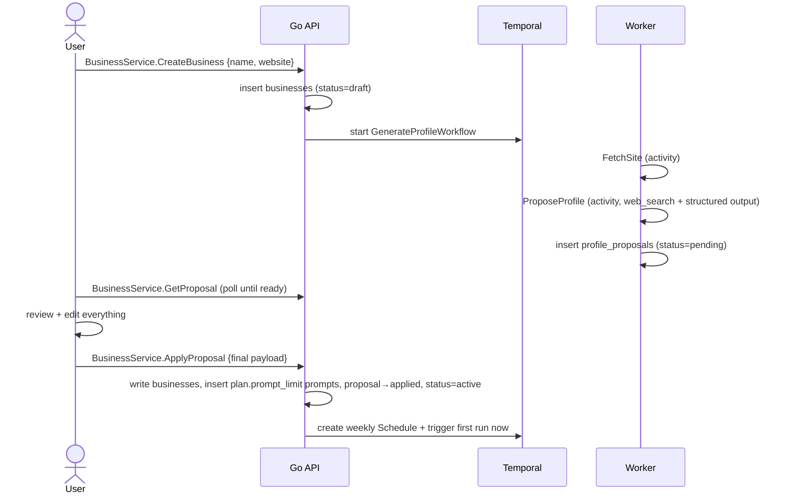

# Design 03 — Onboarding Pipeline

Depends on: [01 Architecture](01-architecture.md), [02 Data Model](02-data-model.md) (`businesses`, `profile_proposals`, `prompts`)

## Flow



Generation is LLM work with agentic web browsing plus a possible validation retry, so end-to-end runtime is on the order of a minute, occasionally more. GenerateProfileWorkflow runs to completion with no fixed deadline; the UI polls proposal status and, while generating, shows a stage-driven step list (reading the website → researching and drafting) rather than assuming a fixed budget.

## GenerateProfileWorkflow

Two activities, each independently retryable:

1. **FetchSite** — plain HTTP GET of the homepage plus obvious high-value paths (`/about`, `/services`, `/team`, `/doctors`, `/contact`, and anything linked from the homepage nav; sitemap.xml if present). HTML stripped to text, capped (~50KB total). **No headless browser in MVP** — clinic sites that render nothing without JS produce empty text and the combined call browses instead. Fetching is SSRF-guarded: http(s) only, DNS resolved with private/link-local/metadata ranges refused, redirects capped and re-validated per hop, response size and time capped. It is the free, deterministic, **primary** evidence source; feeding its text into the next call also reduces the model's own billable browsing.
2. **ProposeProfile** (combined research + draft) — a single OpenAI Responses call through the official Go SDK on a reasoning model that has the `web_search` tool attached with `tool_choice: "required"` **and** a strict structured-output JSON schema. The model searches/opens pages, then emits schema-conforming JSON in one call. It (1) confirms what the business is and its specialty/category, (2) finds organization-only aliases (former names, Chinese names, colloquial/abbreviated **trading** names — never a person's name unless genuinely part of the trading name, e.g. "Dr Tan's Orthopaedic Practice"; mention matching operates on organizations, not people — 05), and (3) finds directory listings. `site_text` is treated as primary evidence when present; when it is empty or thin the model is told the website URL and instructed to open and read the site itself (reasoning models support agentic `open_page`/`find_in_page` browsing). The instructions retain only business rules the schema cannot express: evidence-backed category and confidence, organization-only aliases, prompt diversity, no business names in prompts, city-only geography, and retry correction. If output fails validation (wrong prompt count, empty fields), it retries once with the validation errors appended.

`web_search` on reasoning models supports agentic browsing (`open_page`/`find_in_page`), so it can read a specific URL — including JS-only sites FetchSite can't render. FetchSite is nonetheless kept as the deterministic, free primary source; the model browses to fill its gaps. Whether FetchSite can be retired entirely is an open question pending observed `open_page` reliability in production (the spike showed it opening the exact site URL on every run).

The onboarding model is configurable via `OPENAI_ONBOARDING_MODEL` (separate from the monitoring/analysis model), defaulting to a reasoning model with agentic browsing.

**Sources.** Under strict JSON output the response carries no `url_citation` annotations (there is no prose to annotate — empirically zero across every spike run), so `sources` is derived server-side from the `web_search_call` **actions**: the pages the model opened (`open_page`/`find_in_page` URLs), normalized (utm stripped, host lowercased) and deduped. This is a `sources` array on the proposal payload, populated by us and shown read-only in review; it is never part of the model's own schema and is not persisted to `businesses`.

The workflow exposes its current stage (`fetching_site` | `drafting`) via a Temporal query (`generation-stage`), advanced between activities so a retry never regresses it. `BusinessService.GetProposal` includes `stage` while status is `generating`, degrading to omission if the query fails (e.g. worker briefly unavailable, a pre-deploy run without the handler); the poll never fails on a stage-query error.

Failure posture: FetchSite is no longer a success gate — its text feeds the combined call, and on failure the model still has its own web research. If FetchSite fails, force `low_confidence: true` **unless** the model's web-search actions show an `open_page` on the business website's own domain (it read the site itself), in which case the model's own `low_confidence` judgement stands. The workflow fails only when the combined call fails outright (provider error after Temporal retries) or never validates after the in-activity retry — the UI then offers manual setup (same review screen, empty).

## Proposal payload (`profile_proposals.payload`)

```jsonc
{
  "low_confidence": false,
  "profile": {
    "name": "…",
    "aliases": ["…"],
    "category": "…",            // e.g. "orthopaedic clinic"
    "services": ["…"],
    "location": { "address": "…", "area": "…", "city": "Singapore", "country": "SG" }
  },
  "prompts": [ { "text": "…" } ],
  "sources": [ { "url": "…", "title": "", "domain": "…" } ]  // server-populated, read-only
}
```

`sources` is omitted when the model opened no pages. It is computed by us from the model's web-search actions (not part of the model's schema), so it is only informational — apply never persists it into `businesses`.

### Prompt generation rules

The 20 prompts are the product's measurement instrument, so generation is opinionated:

- **Prompts never contain the business name.** They simulate a prospective patient who doesn't know the business exists — that is what "visibility" means. (Users can still add branded prompts manually if they insist.)
- Vary the set across broad category searches ("best orthopaedic clinic in Singapore"), specific services ("where to get ACL reconstruction in Singapore"), and symptoms or problems ("knee pain won't go away who should I see in Singapore"). Grounded in the business's city only — never a neighbourhood, district, street, or landmark within it (`address`/`area` are kept on the profile but not used for prompt generation).
- Phrased the way real people ask chatbots — questions and problem statements, not keyword strings.
- Count comes from `plan.prompt_limit`, not a hardcoded 20.

## Review and apply

- The review screen is a three-step, in-memory draft: **Business → Services → Customer questions**. Back/next navigation retains edits, and each step must be valid before advancing. Business contains identity, aliases, location, and a collapsed read-only list of research sources; a global low-confidence warning remains visible throughout. Services owns the editable service list. Customer questions shows an exact `current of prompt_limit` count and requires that exact count before approval.
- Nothing is committed while moving through the review steps. The client sends back the **final edited payload** only when the user selects **Approve setup and start monitoring** — the server does not merge, it takes the submitted values verbatim (they've been reviewed by definition). The approval copy states that the first check starts after approval and monitoring then runs weekly; it does not imply that step navigation saves the draft to the server.
- `AuthService.GetMe` exposes the tenant plan's `prompt_limit`. Per-step validation covers required profile fields, country code, non-empty list entries, prompt text, and exact plan prompt count. Validation gates navigation and submission but does not normalize or rewrite the payload: the accepted payload is still sent verbatim.
- **Apply is the only path that writes profile values to `businesses`** (the 02 invariant). It runs in one transaction: update business columns, insert prompts (all `active`), mark proposal `applied`, set business `active`. Then: create the Temporal weekly Schedule and **trigger the first run immediately** — PRD success criterion 4 ("view the first ChatGPT results") shouldn't wait a week.
- **Regenerate** is allowed while the business is `draft`: discard the pending proposal and re-run the workflow. If the user has edited the in-memory review draft, the UI warns that regeneration will replace those edits before proceeding. After activation there is no regenerate — profile changes are manual edits in Setup (PRD: confirmed values are never auto-overwritten), and prompt changes go through the replace flow (02).

## API surface (this slice)

```
BusinessService.CreateBusiness       → create draft, start workflow
BusinessService.GetProposal          → status + payload when ready
BusinessService.RegenerateProposal   → discard + regenerate (draft only)
BusinessService.ApplyProposal        → apply final payload, activate, schedule
```

## Open questions (owned by later increments)

- **05**: whether `aliases` collected here are sufficient for mention matching, or matching needs its own enrichment loop.
- **06**: review-screen UX details (per-field confidence display).
