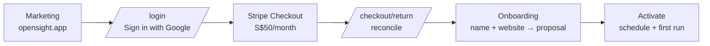

# Design 08 — Self-Serve Signup and Billing

Depends on: [02 Data model](02-data-model.md) (entitlements), [03 Onboarding](03-onboarding.md) (activation), [04 Monitoring](04-monitoring.md) (schedules), [07 Cross-cutting](07-cross-cutting.md) (auth, secrets)

Closes 07's deferred items for signup and billing. Replaces the invite-only account model and the `plans` table.

## The funnel: card before anything



**Payment is taken before the first LLM call.** Every downstream cost — profile generation, 20 prompt executions, analysis — sits behind a successful charge, so there is no free-spend surface to abuse and no in-app spend circuit breaker to build.

Email verification was never MVP scope to begin with: Google's ID token already asserts a verified address (07 "Auth and accounts"), so there is nothing left to verify. What card-first still buys is the free-resource-abuse backstop a verified mailbox alone wouldn't: it costs conversion — the user pays before seeing their own data — and the marketing site carries that weight (product, pricing, and FAQ pages explain the method and the evidence model before signup).

Consequence for onboarding (03): a signed-up, paid account with no business yet is a normal state. Onboarding is unchanged except that reaching it requires `access = full`.

## Commercial model

| | |
|---|---|
| Product | `OpenSight Starter` — one Stripe Product per plan tier, never multiple tiers on one Product (line items render the Product name) |
| Price | SGD 50.00 / month, recurring. Annual is a second Price on the same Product if it ever exists |
| Trial | None. The pricing page promises none, and card-first already qualifies intent |
| Seats | Not billed. One account = one subscription; an account may have multiple members |
| Tax | `automatic_tax` **off** at launch — see below |

**Tax is off deliberately, not by omission.** Stripe Tax calculates and collects nothing — and returns no error — until there is an active Tax Registration. Enabling `automatic_tax` without one produces a silent, confident zero. OpenSight is below the Singapore GST registration threshold at launch, so the correct state is off. Switching on later is: register for GST → add the SG registration in the Stripe Tax Registrations API/dashboard → set `automatic_tax: {enabled: true}` on Checkout Sessions → decide inclusive vs exclusive presentation on the pricing page. Not before.

## Entitlements move from a table to code

The `plans` table and former `accounts.plan_id` are **dropped**. Plan entitlements become a catalog in `internal/billing`:

```go
// internal/billing/catalog.go
var Starter = Plan{
    Code:        "starter",
    Name:        "OpenSight Starter",
    PromptLimit: 20,
    RunInterval: "weekly",
    Platforms:   []string{"chatgpt"},
    PriceEnvKey: "STRIPE_PRICE_STARTER_MONTHLY",
}
```

02's principle stands unchanged — *nothing reads "20" or "weekly" from a literal* — but the source of truth moves from a seeded row to a versioned catalog. Rationale:

- A limit and the Stripe Price it is sold against must agree. In the table model they live in two systems seeded independently per environment, and dev/prod drift is invisible until a customer is billed for entitlements they don't have. In the catalog model the pairing is one Go value, deployed as one unit, covered by tests.
- Changing an entitlement becomes a code change with a test and a deploy, rather than a migration plus a hand-run production `UPDATE`. At a catalog of one plan, the "no deploy needed" flexibility of a table buys nothing and costs correctness.
- `plan_code` is a stable string shared with Stripe (Price metadata, subscription metadata), so an operator can trace a Stripe subscription to its entitlements without a database.

An unknown `plan_code` in the database is an error, never a silent default — same rule as 04's unknown `run_interval`.

## Schema

```sql
subscriptions (
  account_id             uuid PRIMARY KEY REFERENCES accounts(id),
  plan_code              text NOT NULL,            -- resolves against the code catalog
  stripe_customer_id     text UNIQUE NULL,         -- permanent once created; survives cancellation
  stripe_subscription_id text UNIQUE NULL,         -- null until the first successful checkout
  stripe_status          text NULL,                -- VERBATIM Stripe status; never invented locally
  past_due_since         timestamptz NULL,         -- set when status first becomes past_due, cleared
                                                   -- when it leaves; anchors the dunning bound
  comped                 boolean NOT NULL DEFAULT false,
  current_period_end     timestamptz NULL,
  cancel_at_period_end   boolean NOT NULL DEFAULT false,
  created_at, updated_at
)
```

One `subscriptions` row per account, created with `plan_code = 'starter'` and every Stripe column null. It is the account's permanent billing record, not a per-subscription log — Stripe holds subscription history, and duplicating it locally would create a second thing to keep correct for no query we need.

Two deliberate shapes:

- **`stripe_status` is verbatim.** It holds exactly what Stripe reports (`active`, `past_due`, `canceled`, `incomplete`, …) and nothing else. Local concepts never contaminate it, so a status question is always answerable against Stripe's documentation rather than our folklore.
- **`comped` is a separate boolean, not a status value.** Design partners and internal accounts get access with no Stripe objects at all. Encoding that as a fake status would have made every `stripe_status` comparison lie.

## Access: one derived authorization primitive

Every gate in the system asks one question, answered by one pure function, `billing.DeriveAccess` (`internal/billing/access.go`, BILL-4):

```go
type Access int // AccessNever | AccessFull | AccessLapsed

// State is the access-relevant slice of a subscriptions row.
type State struct {
    Comped               bool
    StripeSubscriptionID string
    StripeStatus         string
    PastDueSince         time.Time
}

func DeriveAccess(st State, now time.Time) Access
```

`DeriveAccess` takes the primitives `State`, never `store.Subscription`: `internal/store` imports `internal/billing` for the plan catalog, so the reverse dependency would cycle. `store.Subscription.AccessState()` is the single adapter that bridges the two, dereferencing the row's nullable Stripe columns into `State`'s plain fields. The wire enum lives in `common.proto`, not `billing.proto`, because `AuthService.GetMe` (BILL-6) carries the same `Access` value the checkout RPCs do.

| Condition | Access | Meaning |
|---|---|---|
| `comped = true` | `full` | Operator-granted; no Stripe objects |
| `stripe_status ∈ {active, trialing}` | `full` | Paid |
| `stripe_status = past_due` **and** `now < past_due_since + 21d` | `full` | In dunning, within the app-side bound |
| `stripe_status = past_due` **and** `now ≥ past_due_since + 21d` | `lapsed` | Dunning outlived its bound — see below |
| `stripe_subscription_id IS NULL` | `never` | Signed up, never paid — nothing to read |
| anything else (`canceled`, `unpaid`, `incomplete`, `incomplete_expired`, `paused`) | `lapsed` | Was paid; history stays readable |

**`past_due` keeps full access on purpose — meaning weekly runs keep firing and keep spending OpenAI money**, not merely that the customer can still log in. A failed card is usually an expiry rather than a decision, and Stripe's smart retries run across the configured two-week window; at 04's ~$0.50–2 per account-week that is a bounded worst case of a few dollars per dunning customer before cancellation pauses the schedule. It buys the thing that cannot be bought back: monitoring is a time series, so a week not collected can never be backfilled, and pausing on day one of dunning would punch a permanent hole in the trend data of a customer who fully intended to pay. **Stripe decides when dunning ends; the app bounds how long it will wait.**

Normal path: Stripe's retry window runs to exhaustion, the dashboard's end-of-dunning action **cancels** the subscription (not `unpaid`), and the resulting `customer.subscription.deleted` webhook flips access to `lapsed` and pauses the schedule. No timer, no staleness job — we react. The retry window is **set explicitly to two weeks** rather than inherited from a default; at weekly cadence that caps normal exposure at ~2 runs (~$1–4).

The bound exists because that end-of-dunning action is an **account-level dashboard setting, not an API field and not in version control** — and one of its options is *leave the subscription past due*, under which **Stripe never cancels** and a subscription sits in `past_due` indefinitely. A single mis-set checkbox would otherwise mean unlimited free service with no code change, no test failure, and no signal. So `past_due` grants full access for at most **21 days** from `past_due_since`, a timestamp reconcile writes when the status first becomes `past_due` and clears when it leaves. Twenty-one days is deliberately well clear of the two-week Stripe window, so in correct operation this never fires — it is a backstop, not a policy.

The anchor is our own column rather than `current_period_end` on purpose: Stripe's period semantics during dunning are subtle, and a safety net should not depend on a detail that is easy to get subtly wrong.

This needs no scheduled job. Access is a pure function of the row *and the current time*, and gates 1 and 3 recompute it on every request and every run start, so the bound takes effect the moment it passes. Only gate 2 (pausing the schedule) is event-driven, and it was always just an optimization — an unpaused schedule whose runs all no-op costs nothing.

Because the pause happens when the webhook lands, a schedule firing in the same hour as a cancellation can still start. Gate 3 is what makes that harmless.

`trialing` maps to full even though no trial is sold. Mapping a status we don't currently issue costs one table row and removes a footgun from the day a trial is switched on.

## Enforcement: three gates, one of them authoritative

**1. Access gate (RPC).** Every procedure is classified by one exhaustive policy containing identity/account scope, minimum membership role, and billing access class. Identity-only methods include logout, global `GetMe`, account creation, and checkout confirmation. Account methods resolve membership from `X-OpenSight-Account-Slug`. Billing access classes remain `account` (any billing state), `subscriber` (`full` or `lapsed`), and `active` (`full`). A billing denial returns `CodeFailedPrecondition` plus `AccessDenied`; insufficient membership role returns `CodePermissionDenied`. **The gate protects spend, not historical data**: permitted reads remain available while lapsed, while LLM and schedule operations require `active` and at least `admin`. Billing and ownership actions require `owner`. Classification is default-deny and descriptor-tested. Account context and billing access are derived fresh on every request, so role removal and the dunning bound both take effect immediately.

**2. Sweep filter.** The scheduler sweep inserts jobs only for businesses whose current derived access is `full`; there is no per-business schedule state.

**3. Spend backstop (monitoring job).** `monitoring job` resolves the business's account access before anything that costs money or writes history, and returns immediately — no `monitoring_runs` row, no prompt executed — if access is not `full`. This is the authoritative gate, because gates 1 and 2 both depend on a webhook that may be delayed, dropped, or processed after a schedule has already fired. **A missed webhook must never cost money.** Everything else can be eventually consistent; this cannot.

A run already in flight when a cancellation lands is allowed to finish. It is one run's worth of cost inside a period the customer paid for, and killing it would leave a partial run in the history the product is built on.

The prompt-limit check (02's `count(active) <= prompt_limit`) reads the catalog through the account's `plan_code`.

## Stripe integration

**Client.** `github.com/stripe/stripe-go/v86`, with the concrete client in `internal/billing/stripe`. Each consumer declares only the Stripe operations it needs (`internal/api` owns the checkout/portal/price seam; `internal/billing/reconcile` owns the subscription-read seam), and tests use the in-memory fake. There is no shared provider abstraction: Stripe is the only serving implementation in every environment, and local development uses its sandbox rather than a runtime stub mode. Stripe Prices are immutable, so the API layer caches them per price id for the process lifetime rather than re-fetching every `GetBilling` call. The adapter declares its own `APIVersion` constant (`2026-06-24.dahlia`) and asserts it matches the SDK's in a test, so a stripe-go upgrade that moves the API version fails CI rather than silently changing behavior between deploys (the SDK always sends its own `APIVersion` as `Stripe-Version`, with no per-request override — pinning is therefore a build-time guarantee, not a runtime one). Production authenticates with a **restricted API key** (`rk_`) scoped to write Checkout Sessions, Customers and Billing Portal Sessions and read Subscriptions — not a secret key. This is enforced by the go-live checklist, not by code: sandbox keys are `sk_test_`, so a `rk_` prefix check in `internal/config` would break local development against the Stripe sandbox.

**Customer.** One Stripe Customer per **account**, the commercial and collaboration boundary. Created lazily when an owner starts the account's first Checkout Session, with `metadata.account_id`. It is never recreated — a lapsed account that resubscribes reuses the same Customer, keeping one invoice history per customer account.

The id is persisted **write-once**: `Store.SetStripeCustomerID` (BILL-4) updates by `account_id` with `COALESCE`, touching no other column. This is deliberately not the full-row `Upsert`, for two independent reasons: a row read before the network round trip could clobber a concurrent reconcile write, and it cannot express write-once when two tabs start checkout concurrently.

**Accepted crash window:** a crash between creating the Customer at Stripe and persisting its id leaves an orphan Customer — `metadata.account_id` set, no subscription, no invoice, no charge, nothing customer-visible. The retry creates a second Customer and persists that one. This is accepted, not engineered around: nothing bills a Customer with no subscription, the orphan is traceable by metadata and deletable from the dashboard, and "permanent" is a guarantee about the persisted id.

**Checkout Session** (`mode: subscription`):

- `customer` — the persisted Customer id.
- `line_items: [{price: <starter monthly price id>, quantity: 1}]`.
- `client_reference_id: <account_id>` and `subscription_data.metadata.account_id` — belt and braces alongside the Customer lookup.
- `integration_identifier` — a stable label, generated once by a developer and committed as a constant (e.g. `opensight-signup-vqmzhrtk`), so checkout performance is comparable in the dashboard. The 8-letter suffix exists only to avoid collision with other integrations, not to vary per session — a per-request random suffix would produce a population of one and defeat the purpose.
- `success_url: {APP_BASE_URL}/checkout/return?session_id={CHECKOUT_SESSION_ID}`, `cancel_url: {APP_BASE_URL}/a/{account_slug}/billing`.
- **No `payment_method_types`.** Omitted entirely so eligible methods are configured in the dashboard and chosen dynamically per customer. Hardcoding `['card']` would lock out methods that convert.

**Webhook** — `POST /webhooks/stripe`, a chi route outside `/rpc`:

- Reads the **raw body** before any parsing middleware and verifies the signature with the endpoint's signing secret. An unverified event is a 400. Deliveries and their payloads are not persisted: Stripe retains the event history, while the app only needs the current subscription state.
- **Never trusts the event payload's subscription state.** Stripe does not guarantee delivery order, so a stale `updated` arriving after a `deleted` would otherwise resurrect a dead subscription. The handler takes only the *identity* from the event (customer id) and then **re-fetches the subscription from the API**, writing that.
- Duplicate deliveries simply reconcile the same Customer again. Reconcile is desired-state based rather than an additive side effect, so persisted event-id deduplication would add machinery without changing the result.
- Returns 200 for events it does not handle, and 500 only when reconcile genuinely failed — so Stripe's retry means something.

Subscribed events: `checkout.session.completed`, `customer.subscription.created`, `customer.subscription.updated`, `customer.subscription.deleted`. Invoice events are not subscribed: Stripe's own emails handle receipts and dunning notification, and every state we care about is reachable from the subscription.

**Reconcile** is one path, keyed by the Stripe Customer: acquire a PostgreSQL session-level advisory lock for that Customer, reload the local row under the lock, fetch the current subscription, write the `subscriptions` row, and assert whether monitoring must be running or paused. The lock is held on a dedicated database connection across the fetch and write, so webhook deliveries and checkout returns cannot race even across multiple app instances. The webhook calls it. The checkout return calls it. There is exactly one code path that can change billing state, so the two entry points cannot disagree.

It lives in its own package, `internal/billing/reconcile` (BILL-4), not as a method on `api.Server` and not as a file in `internal/billing` itself: `internal/billing` cannot host it without a cycle (its seam would need to speak `store.Subscription`, and `internal/store` already imports `internal/billing`), and hanging it off `api.Server` would make future admin tooling depend on `internal/api`. The single writer is reached through `Reconciler.Account(ctx, accountID)` for checkout return and `Reconciler.ByCustomer(ctx, customerID)` for webhooks; both funnel into the same apply path.

Billing reconcile writes subscription truth only. The next sweep derives access from that row, while every monitoring job recomputes access again before spend.

**Checkout return.** `success_url` remains the unprefixed `/checkout/return` so outstanding Stripe Sessions survive the route migration. `BillingService.ConfirmCheckout(session_id)` is identity-scoped: it derives the account from Stripe's `client_reference_id`, verifies the current user is an owner, reconciles, and returns the account slug for navigation. The page retries the idempotent confirmation for a short bounded window while Stripe settles; the webhook remains the source of truth.

**Customer Portal** handles cancellation, card updates, and invoice history — all of it Stripe-hosted, none of it code we own or PCI surface we touch. `BillingService.CreatePortalSession` is owner-only and returns a redirect URL with `return_url` to `/a/{account_slug}/billing`. An account with no Stripe Customer (never paid, or comped — comped accounts have no Stripe objects at all) is refused rather than sent to a broken portal.

`GetBilling` also returns the single server-derived billing action, and the dividing line is whether the subscription has ever been paid. `past_due`, `unpaid` and `paused` all follow a successful first charge, so the portal can revive them even when access is lapsed. Everything else gets Checkout: no subscription, `canceled`, or an initial payment that never landed. Comped accounts get no action. Billing RPCs and the billing page are owner-only; other members see only the account-level access message exposed by account context and are told to contact an owner.

The billing page lives inside the normal authenticated workspace shell. A never-paid workspace still exposes workspace-safe navigation such as Members and Billing, while business monitoring routes remain gated until subscription and onboarding are complete. Billing is therefore part of the product's workspace context rather than a standalone checkout island.

The portal's behaviour — payment-method updates, invoice history and cancellation on, plan switching **off** (there is one plan; an empty switcher is worse than none) — is recorded as code, not left as a Stripe dashboard default: `internal/billing.DesiredPortalConfig` is the desired Billing Portal Configuration. Each Stripe environment gets one configuration provisioned during environment bootstrap, and its `bpc_...` id is stored as `STRIPE_PORTAL_CONFIGURATION_ID` in that environment's protected deployment configuration. `opensight stripe portal-config` (`cmd/opensight/stripe.go`) requires that id and idempotently updates that exact object; it never discovers ownership through metadata and never creates a configuration during a recurring deployment.

The same id is required by the main server. Startup fails when it is absent, and every `CreatePortalSession` call pins the session to it rather than falling back to the Stripe account default. The deployment job and serving process therefore refer to exactly the same configuration object: deployment defines its desired behaviour, and runtime selects it for every customer.

Production applies the configuration in a protected pre-deploy pipeline job built from the release commit. The job receives the pre-provisioned configuration id, a command-only Stripe administration key, and `APP_BASE_URL`, then runs `opensight stripe portal-config`. A missing or invalid id fails the deployment. The serving process receives the same id but retains its narrower restricted runtime key and never receives the administration key. Local development provisions one configuration in the sandbox, stores its id in `.env`, and runs the same command manually.

### RPC surface

```proto
service BillingService {
  rpc GetBilling(GetBillingRequest) returns (GetBillingResponse);                            // BILL-9
  rpc StartCheckout(StartCheckoutRequest) returns (StartCheckoutResponse);                    // BILL-4, → checkout_url
  rpc ConfirmCheckout(ConfirmCheckoutRequest) returns (ConfirmCheckoutResponse);               // BILL-4
  rpc CreatePortalSession(CreatePortalSessionRequest) returns (CreatePortalSessionResponse);  // BILL-8, → portal_url
}
```

All four exist today, in `proto/opensight/v1/billing.proto`.

There is no public RPC: sign-in itself is the `/auth/google/*` HTTP redirect flow. Global `GetMe` returns the user and membership summaries; `AccountService.GetAccountContext` returns the selected account's businesses, role, plan, and billing access. No method is ever declared `idempotency_level = NO_SIDE_EFFECTS` (07's CSRF guarantee).

Session resolution yields only the global user. Account resolution verifies a membership for the requested slug and joins the account's subscription, exposing its plan code and raw billing state. Every account must have exactly one subscription row; a missing row is an internal error, not a silent default.

## Lapse and reactivation

```
active ──cancel in portal──▶ cancel_at_period_end=true   full access until period end
                                      │
                          period end / dunning exhausted
                                      ▼
                                   lapsed:  schedule paused
                                            history, metrics, evidence  read-only ✓
                                            prompt and competitor edits  stay available
                                            new runs and profile generation  ✗
                                      │
                                 reactivate (Portal once a charge has landed;
                                   new Checkout when none ever did,
                                   always using the same Customer)
                                      ▼
                                    full:  schedule unpaused, next run on schedule
```

Historical results *are* the product (02: retention is indefinite because trends are the value). Locking a lapsed customer out of the evidence they spent months accumulating destroys the strongest reason to come back, so lapse pauses collection and preserves reading. A generic, non-dated shell banner states that monitoring has stopped; owners get the reactivation action and other roles are directed to an owner. Exact dates live on the account-scoped billing page.

**Flexible billing mode and `cancel_at`.** A live sandbox `subscriptions.update` call (BILL-9) confirmed Stripe's documented flexible-billing-mode behavior (the default from API version `2025-09-30.clover` onward, which our pinned `2026-06-24.dahlia` postdates): a Customer Portal "cancel at period end" sets `cancel_at` to the effective end instant and leaves `cancel_at_period_end` **false**. `subscriptionFromStripe` (`internal/billing/stripe/stripe.go`) treats a non-zero `cancel_at` as itself a scheduled cancellation — setting `CancelAtPeriodEnd` true and taking `CurrentPeriodEnd` from `cancel_at`, which is also the more accurate end date since it does not drift if a later billing period starts (unlike the item's `current_period_end`).

Reactivation touches nothing but billing: business, profile, prompts and every stored run are untouched, the next eligible sweep resumes scheduling, and the trend simply has a gap where nothing was collected. That gap is honest and must render as a gap — never interpolated (04's rule that charts show only observed values). The SPA (`web/src/lib/trend-gaps.ts`, BILL-10) breaks a trend line at any interval wider than 2× the plan's `run_interval` — one missed run is a hiccup a straight line can absorb, sustained absence is a gap that must show as one.

## Signup

There is no separate signup RPC. `GET /auth/google/callback` (07 "Auth and accounts") resolves or creates the global user. If that user has no memberships, it transactionally creates an account, unpaid Starter subscription, and owner membership, then mints the session. Users who already have memberships are never given another account implicitly; explicit `AccountService.CreateAccount` creates an additional unpaid Starter account and owner membership.

- No form is collected at all: email comes from Google's verified ID token. The business name and website are onboarding's first screen, where they are actually used; asking twice costs conversion at the point it is most fragile.
- `accounts.name` defaults to the email local part and is replaced with the first business name during onboarding. Migration from the original tenant schema likewise replaces legacy provisioning labels with the first business name. The stable account slug does not change. Product copy calls this boundary a **workspace**; `account` remains the precise API and data-model term.
- Rate limited per IP at Caddy (07), alongside `/rpc`.

Account recovery and other sensitive account-management actions belong in a future admin portal rather than a growing collection of one-off CLI commands — but password reset itself is no longer one of them: Google owns credential recovery.

## Operator-created accounts

`opensight account create` creates comped accounts. Design partners and internal accounts therefore get full access with no Stripe objects, no card, and no ambiguity about whether a real subscription exists. `opensight account member add` grants a role by email without sending an invitation. Changing an existing account's comp status is deferred to a future admin portal.

## Local development and testing

- **Local runtime.** `stripe sandbox create` for keys; `stripe listen --forward-to localhost:8080/webhooks/stripe` for signed webhook delivery against local code; `stripe trigger` for lifecycle events. Test cards cover success, decline, and the `4000000000000341` attach-then-fail path that produces `past_due`.
- **Automated tests.** Adapter tests use Stripe's client test backend; API and reconciliation tests use narrow package-local fakes. The suite makes no Stripe calls and needs no credentials, and no fake provider is selectable by runtime configuration.
- Reconcile is a pure-ish function over a fetched subscription — the access table above is table-tested directly, without Stripe or a database.

## Config and secrets

| Env var | Purpose |
|---|---|
| `STRIPE_SECRET_KEY` | Restricted key (`rk_`) in production, scoped as above; a sandbox key (`sk_test_`) locally. The `rk_` prefix is a go-live checklist item (12), not a code check — sandbox keys don't have it |
| `STRIPE_WEBHOOK_SECRET` | Endpoint signing secret, captured from `opensight stripe webhook-config`'s create output (go-live checklist item 6) |
| `STRIPE_PRICE_STARTER_MONTHLY` | Price id for the Starter monthly Price |
| `APP_BASE_URL` | Required absolute base for checkout/portal return URLs; `http://localhost:5173` is set explicitly in local `.env` |
| `STRIPE_PORTAL_CONFIGURATION_ID` | Pre-provisioned Billing Portal Configuration id for this Stripe environment. Required by both the configuration job and `opensight serve`; runtime never falls back to the account default |

Added to 07's `.env` inventory and to the restic backup set by virtue of that file already being included.

## Go-live checklist

1. Stripe account activated; SGD payouts configured.
2. Product `OpenSight Starter` + monthly SGD 50.00 Price created; Price id in `.env`.
3. Payment methods configured in the dashboard (dynamic — cards plus whatever converts in SG).
4. Dunning — **Dashboard-only, both settings; Stripe exposes neither through the API**, so these cannot be scripted, reviewed, or asserted in a test, and must be set by hand per account (sandbox settings do not carry to live):
   - Retry policy → [`/revenue_recovery/retries`](https://dashboard.stripe.com/revenue_recovery/retries): Smart Retries on, window **2 weeks**. Stripe's own recommended policy is 8 attempts within 2 weeks, so this is their default rather than a custom rule.
   - End of dunning → [`/settings/billing/automatic`](https://dashboard.stripe.com/settings/billing/automatic) → *Manage failed payments for subscriptions*: **cancel the subscription**. Never *leave past due* — Stripe then never cancels, and the subscription sits in `past_due` forever. Invoice status alongside it: mark uncollectible (Stripe pairs this with cancellation anyway).

   Both are the reason `past_due_since` exists: a setting that cannot be version-controlled or tested is a setting that will eventually be wrong.
5. Customer Portal: provision one live configuration, store its id as protected `STRIPE_PORTAL_CONFIGURATION_ID`, and have the pre-deploy job update that exact id with its command-only administration key. Payment method + invoice history + cancellation on, plan switching off, and `return_url` to `/billing` are asserted by the command rather than configured by hand. The server receives the same id and pins every session to it.
6. Webhook endpoint: `opensight stripe webhook-config` idempotently creates or updates the endpoint at `https://dashboard.opensight.app/webhooks/stripe` with the four subscription events, mirroring the portal-config command above. Stripe returns the signing secret only once, in the create response — capture it into `STRIPE_WEBHOOK_SECRET` there; a later run against the same URL updates the event list without touching the secret.
7. Restricted API key minted with the minimum scopes; secret key never deployed.
8. End-to-end rehearsal in the sandbox: signup → checkout → onboarding → first run → portal cancel → verify schedule paused and history readable → reactivate → verify schedule resumed.
9. Sweep Stripe for Customers with no subscription older than a day — the accepted crash-window orphans (see "Customer") — and delete them. An eyeball check, not automated: they cost nothing and never bill, but a growing pile is a signal something upstream is failing repeatedly rather than the rare crash this accepts.

## Deliberately deferred

Changing comp status; annual pricing and any second tier; proration and upgrade/downgrade flows; in-app invoice list; usage-based, per-prompt, or seat pricing; business-specific ACLs; Stripe Tax (until GST-registered); account self-deletion.
