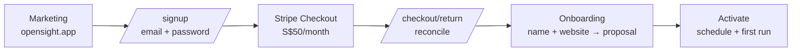

# Design 08 — Self-Serve Signup and Billing

Depends on: [02 Data model](02-data-model.md) (entitlements), [03 Onboarding](03-onboarding.md) (activation), [04 Monitoring](04-monitoring.md) (schedules), [07 Cross-cutting](07-cross-cutting.md) (auth, secrets)

Closes 07's deferred items for signup and billing. Replaces the invite-only account model and the `plans` table.

## The funnel: card before anything



**Payment is taken before the first LLM call.** Every downstream cost — profile generation, 20 prompt executions, analysis — sits behind a successful charge, so there is no free-spend surface to abuse and no in-app spend circuit breaker to build.

This also removes email verification from MVP scope: a completed card charge is a stronger identity and intent signal than a verified mailbox, and verification exists mainly to stop exactly the free-resource abuse that card-first already prevents. The cost is conversion — the user pays before seeing their own data. The marketing site carries that weight (product, pricing, and FAQ pages explain the method and the evidence model before signup).

Consequence for onboarding (03): a signed-up, paid tenant with no business yet is a normal state. Onboarding is unchanged except that reaching it requires `access = full`.

## Commercial model

| | |
|---|---|
| Product | `OpenSight Starter` — one Stripe Product per plan tier, never multiple tiers on one Product (line items render the Product name) |
| Price | SGD 50.00 / month, recurring. Annual is a second Price on the same Product if it ever exists |
| Trial | None. The pricing page promises none, and card-first already qualifies intent |
| Seats | None. One tenant = one subscription; multi-user tenants are post-MVP |
| Tax | `automatic_tax` **off** at launch — see below |

**Tax is off deliberately, not by omission.** Stripe Tax calculates and collects nothing — and returns no error — until there is an active Tax Registration. Enabling `automatic_tax` without one produces a silent, confident zero. OpenSight is below the Singapore GST registration threshold at launch, so the correct state is off. Switching on later is: register for GST → add the SG registration in the Stripe Tax Registrations API/dashboard → set `automatic_tax: {enabled: true}` on Checkout Sessions → decide inclusive vs exclusive presentation on the pricing page. Not before.

## Entitlements move from a table to code

The `plans` table and `tenants.plan_id` are **dropped**. Plan entitlements become a catalog in `internal/billing`:

```go
// internal/billing/catalog.go
var Starter = Plan{
    Code:        "starter",
    Name:        "OpenSight Starter",
    PromptLimit: 20,
    RunInterval: "weekly",
    Platforms:   []string{"chatgpt"},
    PriceEnvKey: "STRIPE_PRICE_STARTER_MONTHLY",
}
```

02's principle stands unchanged — *nothing reads "20" or "weekly" from a literal* — but the source of truth moves from a seeded row to a versioned catalog. Rationale:

- A limit and the Stripe Price it is sold against must agree. In the table model they live in two systems seeded independently per environment, and dev/prod drift is invisible until a customer is billed for entitlements they don't have. In the catalog model the pairing is one Go value, deployed as one unit, covered by tests.
- Changing an entitlement becomes a code change with a test and a deploy, rather than a migration plus a hand-run production `UPDATE`. At a catalog of one plan, the "no deploy needed" flexibility of a table buys nothing and costs correctness.
- `plan_code` is a stable string shared with Stripe (Price metadata, subscription metadata), so an operator can trace a Stripe subscription to its entitlements without a database.

An unknown `plan_code` in the database is an error, never a silent default — same rule as 04's unknown `run_interval`.

## Schema

```sql
subscriptions (
  tenant_id              uuid PRIMARY KEY REFERENCES tenants(id),
  plan_code              text NOT NULL,            -- resolves against the code catalog
  stripe_customer_id     text UNIQUE NULL,         -- permanent once created; survives cancellation
  stripe_subscription_id text UNIQUE NULL,         -- null until the first successful checkout
  stripe_status          text NULL,                -- VERBATIM Stripe status; never invented locally
  past_due_since         timestamptz NULL,         -- set when status first becomes past_due, cleared
                                                   -- when it leaves; anchors the dunning bound
  comped                 boolean NOT NULL DEFAULT false,
  current_period_end     timestamptz NULL,
  cancel_at_period_end   boolean NOT NULL DEFAULT false,
  created_at, updated_at
)
```

One `subscriptions` row per tenant, created at signup with `plan_code = 'starter'` and every Stripe column null. It is the tenant's permanent billing record, not a per-subscription log — Stripe holds subscription history, and duplicating it locally would create a second thing to keep correct for no query we need.

Two deliberate shapes:

- **`stripe_status` is verbatim.** It holds exactly what Stripe reports (`active`, `past_due`, `canceled`, `incomplete`, …) and nothing else. Local concepts never contaminate it, so a status question is always answerable against Stripe's documentation rather than our folklore.
- **`comped` is a separate boolean, not a status value.** Design partners and internal tenants get access with no Stripe objects at all. Encoding that as a fake status would have made every `stripe_status` comparison lie.

## Access: one derived authorization primitive

Every gate in the system asks one question, answered by one pure function, `billing.DeriveAccess` (`internal/billing/access.go`, BILL-4):

```go
type Access int // AccessNever | AccessFull | AccessLapsed

// State is the access-relevant slice of a subscriptions row.
type State struct {
    Comped               bool
    StripeSubscriptionID string
    StripeStatus         string
    PastDueSince         time.Time
}

func DeriveAccess(st State, now time.Time) Access
```

`DeriveAccess` takes the primitives `State`, never `store.Subscription`: `internal/store` imports `internal/billing` for the plan catalog, so the reverse dependency would cycle. `store.Subscription.AccessState()` is the single adapter that bridges the two, dereferencing the row's nullable Stripe columns into `State`'s plain fields. The wire enum lives in `common.proto`, not `billing.proto`, because `AuthService.GetMe` (BILL-6) carries the same `Access` value the checkout RPCs do.

| Condition | Access | Meaning |
|---|---|---|
| `comped = true` | `full` | Operator-granted; no Stripe objects |
| `stripe_status ∈ {active, trialing}` | `full` | Paid |
| `stripe_status = past_due` **and** `now < past_due_since + 21d` | `full` | In dunning, within the app-side bound |
| `stripe_status = past_due` **and** `now ≥ past_due_since + 21d` | `lapsed` | Dunning outlived its bound — see below |
| `stripe_subscription_id IS NULL` | `never` | Signed up, never paid — nothing to read |
| anything else (`canceled`, `unpaid`, `incomplete`, `incomplete_expired`, `paused`) | `lapsed` | Was paid; history stays readable |

**`past_due` keeps full access on purpose — meaning weekly runs keep firing and keep spending OpenAI money**, not merely that the customer can still log in. A failed card is usually an expiry rather than a decision, and Stripe's smart retries run across the configured two-week window; at 04's ~$0.50–2 per tenant-week that is a bounded worst case of a few dollars per dunning customer before cancellation pauses the schedule. It buys the thing that cannot be bought back: monitoring is a time series, so a week not collected can never be backfilled, and pausing on day one of dunning would punch a permanent hole in the trend data of a customer who fully intended to pay. **Stripe decides when dunning ends; the app bounds how long it will wait.**

Normal path: Stripe's retry window runs to exhaustion, the dashboard's end-of-dunning action **cancels** the subscription (not `unpaid`), and the resulting `customer.subscription.deleted` webhook flips access to `lapsed` and pauses the schedule. No timer, no staleness job — we react. The retry window is **set explicitly to two weeks** rather than inherited from a default; at weekly cadence that caps normal exposure at ~2 runs (~$1–4).

The bound exists because that end-of-dunning action is an **account-level dashboard setting, not an API field and not in version control** — and one of its options is *leave the subscription past due*, under which **Stripe never cancels** and a subscription sits in `past_due` indefinitely. A single mis-set checkbox would otherwise mean unlimited free service with no code change, no test failure, and no signal. So `past_due` grants full access for at most **21 days** from `past_due_since`, a timestamp reconcile writes when the status first becomes `past_due` and clears when it leaves. Twenty-one days is deliberately well clear of the two-week Stripe window, so in correct operation this never fires — it is a backstop, not a policy.

The anchor is our own column rather than `current_period_end` on purpose: Stripe's period semantics during dunning are subtle, and a safety net should not depend on a detail that is easy to get subtly wrong.

This needs no scheduled job. Access is a pure function of the row *and the current time*, and gates 1 and 3 recompute it on every request and every run start, so the bound takes effect the moment it passes. Only gate 2 (pausing the schedule) is event-driven, and it was always just an optimization — an unpaused schedule whose runs all no-op costs nothing.

Because the pause happens when the webhook lands, a schedule firing in the same hour as a cancellation can still start. Gate 3 is what makes that harmless.

`trialing` maps to full even though no trial is sold. Mapping a status we don't currently issue costs one table row and removes a footgun from the day a trial is switched on.

## Enforcement: three gates, one of them authoritative

**1. Write gate (RPC).** Every procedure carries one of four access classes — `public` (no session), `billing` (reachable at any access), `read` (needs `full` or `lapsed`), `write` (needs `full`) — and a request below the required access is rejected with `CodeFailedPrecondition` plus an `AccessDenied` error detail the SPA renders as the billing state. Classification is **default-deny and non-rotting**: `procedureAccess` (`internal/api/rpc.go`) is one total map keyed by every generated procedure constant, so a renamed/removed RPC fails the build; `accessInterceptor` denies (`CodeInternal`) any procedure that reaches it unclassified, and `TestEveryProcedureIsClassified` walks `protoregistry.GlobalFiles` to fail the test suite if a schema procedure is missing from the map. Access is derived fresh on every request from the session's joined billing state and the current time — never cached — which is what makes the dunning bound below take effect the instant it passes, with no scheduled job.

**2. Schedule gate (Temporal).** Reconcile pauses the business's monitoring Schedule when access leaves `full` and unpauses it when access returns. This is the mechanism that actually stops recurring spend, and it is *an optimization*: a paused schedule costs nothing to be slightly late.

**3. Spend backstop (RunWorkflow).** `RunWorkflow` resolves the business's tenant access before anything that costs money or writes history, and returns immediately — no `monitoring_runs` row, no prompt executed — if access is not `full`. This is the authoritative gate, because gates 1 and 2 both depend on a webhook that may be delayed, dropped, or processed after a schedule has already fired. **A missed webhook must never cost money.** Everything else can be eventually consistent; this cannot.

A run already in flight when a cancellation lands is allowed to finish. It is one run's worth of cost inside a period the customer paid for, and killing it would leave a partial run in the history the product is built on.

The prompt-limit check (02's `count(active) <= prompt_limit`) now reads the catalog through the tenant's `plan_code`. Same invariant, different source.

## Stripe integration

**Client.** `github.com/stripe/stripe-go/v86`, behind a `Provider` interface in `internal/billing` with the runtime adapter in `internal/billing/stripe` and an in-memory test fake. Stripe is the only serving implementation in every environment; local development uses its sandbox rather than a runtime stub mode. The adapter declares its own `APIVersion` constant (`2026-06-24.dahlia`) and asserts it matches the SDK's in a test, so a stripe-go upgrade that moves the API version fails CI rather than silently changing behavior between deploys (the SDK always sends its own `APIVersion` as `Stripe-Version`, with no per-request override — pinning is therefore a build-time guarantee, not a runtime one). Production authenticates with a **restricted API key** (`rk_`) scoped to write Checkout Sessions, Customers and Billing Portal Sessions and read Subscriptions — not a secret key. This is enforced by the go-live checklist, not by code: sandbox keys are `sk_test_`, so a `rk_` prefix check in `internal/config` would break local development against the Stripe sandbox.

**Customer.** One Stripe Customer per **tenant** (the billing entity; users are post-MVP plural). Created lazily when the tenant's first Checkout Session is created, with `metadata.tenant_id`. It is never recreated — a lapsed tenant that resubscribes reuses the same Customer, keeping one invoice history per clinic.

The id is persisted **write-once**: `SubscriptionStore.SetStripeCustomerID` (BILL-4) is `UPDATE subscriptions SET stripe_customer_id = COALESCE(stripe_customer_id, $2) WHERE tenant_id = $1 RETURNING stripe_customer_id`, touching no other column. This is deliberately not the full-row `Upsert`, for two independent reasons: `Upsert` is built from a row read before the network round trip to Stripe, so a concurrent reconcile write (BILL-5's webhook) would have its `stripe_status`/`stripe_subscription_id`/`past_due_since` clobbered back to stale values; and `Upsert` cannot express write-once at all — two tabs both starting checkout would create two Customers, and whichever `Upsert` lands second wins, silently detaching the row from whichever Customer the customer actually paid on.

**Accepted crash window:** a crash between creating the Customer at Stripe and persisting its id leaves an orphan Customer — `metadata.tenant_id` set, no subscription, no invoice, no charge, nothing customer-visible. The retry creates a second Customer and persists that one. This is accepted, not engineered around: nothing bills a Customer with no subscription, the orphan is traceable by metadata and deletable from the dashboard, and "permanent" is a guarantee about the *persisted* id, which `COALESCE` enforces at the database regardless of how many orphans preceded it. See the go-live checklist for the operational sweep this implies.

**Checkout Session** (`mode: subscription`):

- `customer` — the persisted Customer id.
- `line_items: [{price: <starter monthly price id>, quantity: 1}]`.
- `client_reference_id: <tenant_id>` and `subscription_data.metadata.tenant_id` — belt and braces alongside the Customer lookup.
- `integration_identifier` — a stable label, generated once by a developer and committed as a constant (e.g. `opensight-signup-vqmzhrtk`), so checkout performance is comparable in the dashboard. The 8-letter suffix exists only to avoid collision with other integrations, not to vary per session — a per-request random suffix would produce a population of one and defeat the purpose.
- `success_url: {APP_BASE_URL}/checkout/return?session_id={CHECKOUT_SESSION_ID}`, `cancel_url: {APP_BASE_URL}/billing`.
- **No `payment_method_types`.** Omitted entirely so eligible methods are configured in the dashboard and chosen dynamically per customer. Hardcoding `['card']` would lock out methods that convert.

**Webhook** — `POST /webhooks/stripe`, a chi route outside `/rpc`:

- Reads the **raw body** before any parsing middleware and verifies the signature with the endpoint's signing secret. An unverified event is a 400. Deliveries and their payloads are not persisted: Stripe retains the event history, while the app only needs the current subscription state.
- **Never trusts the event payload's subscription state.** Stripe does not guarantee delivery order, so a stale `updated` arriving after a `deleted` would otherwise resurrect a dead subscription. The handler takes only the *identity* from the event (customer id) and then **re-fetches the subscription from the API**, writing that.
- Duplicate deliveries simply reconcile the same Customer again. Reconcile is desired-state based rather than an additive side effect, so persisted event-id deduplication would add machinery without changing the result.
- Returns 200 for events it does not handle, and 500 only when reconcile genuinely failed — so Stripe's retry means something.

Subscribed events: `checkout.session.completed`, `customer.subscription.created`, `customer.subscription.updated`, `customer.subscription.deleted`. Invoice events are not subscribed: Stripe's own emails handle receipts and dunning notification, and every state we care about is reachable from the subscription.

**Reconcile** is one path, keyed by the Stripe Customer: acquire a PostgreSQL session-level advisory lock for that Customer, reload the local row under the lock, fetch the current subscription, write the `subscriptions` row, and assert whether monitoring must be running or paused. The lock is held on a dedicated database connection across the fetch and write, so webhook deliveries and checkout returns cannot race even across multiple app instances. The webhook calls it. The checkout return calls it. There is exactly one code path that can change billing state, so the two entry points cannot disagree.

It lives in its own package, `internal/billing/reconcile` (BILL-4), not as a method on `api.Server` and not as a file in `internal/billing` itself: `internal/billing` cannot host it without a cycle (its seam would need to speak `store.Subscription`, and `internal/store` already imports `internal/billing`), and hanging it off `api.Server` would make it untestable without a full `Server` and would force a future CLI comp command to reach into `internal/api`. The single writer is an unexported `apply(ctx, sub store.Subscription) (store.Subscription, error)`, reached through per-source entry points: `Reconciler.Tenant(ctx, tenantID)` for the checkout return (BILL-4, keyed by the id already on the session), and `Reconciler.ByCustomer(ctx, customerID)` for the webhook (BILL-5, which only ever carries a Stripe Customer id). Both funnel into the same `apply`, which is what makes "exactly one code path" a checkable claim rather than a convention.

`apply` derives access from the written row (`billing.DeriveAccess`) and asserts the corresponding Schedule state for every business the tenant has, on every platform its plan covers (BILL-5, `Reconciler`'s nil-tolerant `monitoring` seam, `internal/billing/reconcile/monitoring.go`). This happens on every reconcile, not only when a local before/after comparison detects a transition. Pause and unpause first inspect the Schedule and no-op when it already has the desired state. A monitoring failure is returned: Stripe retries the webhook, and the next desired-state assertion repairs a row-write/schedule-update partial failure. Gate 3, `RunWorkflow`'s spend backstop, remains authoritative while that retry is pending.

**Checkout return.** `success_url` lands on `/checkout/return`, which calls `BillingService.ConfirmCheckout(session_id)`; that retrieves the session server-side, confirms it belongs to this tenant, and runs the same reconcile. Without this, a customer whose webhook is delayed by seconds stares at a page telling them they haven't paid, immediately after paying. The webhook remains the source of truth; this is the latency fix, not a second implementation.

**Customer Portal** handles cancellation, card updates, and invoice history — all of it Stripe-hosted, none of it code we own or PCI surface we touch. `BillingService.CreatePortalSession` returns a redirect URL with `return_url` to `/billing`. A tenant with no Stripe Customer (never paid, or comped — comped tenants have no Stripe objects at all) is refused rather than sent to a broken portal.

The portal's behaviour — payment-method updates, invoice history and cancellation on, plan switching **off** (there is one plan; an empty switcher is worse than none) — is recorded as code, not left as a Stripe dashboard default: `internal/billing.DesiredPortalConfig` is the desired Billing Portal Configuration. Each Stripe environment gets one configuration provisioned during environment bootstrap, and its `bpc_...` id is stored as `STRIPE_PORTAL_CONFIGURATION_ID` in that environment's protected deployment configuration. `opensight stripe portal-config` (`cmd/opensight/stripe.go`) requires that id and idempotently updates that exact object; it never discovers ownership through metadata and never creates a configuration during a recurring deployment.

The same id is required by the main server. Startup fails when it is absent, and every `CreatePortalSession` call pins the session to it rather than falling back to the Stripe account default. The deployment job and serving process therefore refer to exactly the same configuration object: deployment defines its desired behaviour, and runtime selects it for every customer.

Production applies the configuration in a protected pre-deploy pipeline job built from the release commit. The job receives the pre-provisioned configuration id, a command-only Stripe administration key, and `APP_BASE_URL`, then runs `opensight stripe portal-config`. A missing or invalid id fails the deployment. The serving process receives the same id but retains its narrower restricted runtime key and never receives the administration key. Local development provisions one configuration in the sandbox, stores its id in `.env`, and runs the same command manually.

### RPC surface

```proto
service BillingService {
  rpc GetBilling(GetBillingRequest) returns (GetBillingResponse);                            // BILL-9
  rpc StartCheckout(StartCheckoutRequest) returns (StartCheckoutResponse);                    // BILL-4, → checkout_url
  rpc ConfirmCheckout(ConfirmCheckoutRequest) returns (ConfirmCheckoutResponse);               // BILL-4
  rpc CreatePortalSession(CreatePortalSessionRequest) returns (CreatePortalSessionResponse);  // BILL-8, → portal_url
}
```

`StartCheckout`, `ConfirmCheckout`, and `CreatePortalSession` exist today, in their own `proto/opensight/v1/billing.proto`. `GetBilling` is declared here as the target shape but not yet in the `.proto` file, so an unimplemented method reads as "not yet built" rather than a regression. Adding methods to an existing service is backward-compatible; declaring them ahead of the story that implements them would force `Unimplemented` stubs and dead generated TS hooks.

`AuthService.Signup` joins `Login` as `procedureAccess`'s only `public`-class entries; every other procedure is `billing`/`read`/`write` (BILL-6). `GetMeResponse` drops the bare `prompt_limit` int in favour of an `access` enum plus a `Plan` message (`code`, `prompt_limit`, `run_interval`, `platforms`, moved to `common.proto` since `BusinessProfile` no longer carries plan entitlements — a business's plan is the tenant's plan), so the SPA renders entitlements and billing state from one authoritative payload. No method is ever declared `idempotency_level = NO_SIDE_EFFECTS` (07's CSRF guarantee).

Access is resolved alongside the session rather than by a second lookup: `AuthStore.GetSession` LEFT JOINs `subscriptions` on the same query that resolves the session's user and tenant, so `store.SessionUser` carries `plan_code` and the raw billing `State` (not a derived `Access` — that's still computed per-request against the current time) with no extra round trip. The join is a LEFT JOIN deliberately: every tenant is supposed to have exactly one `subscriptions` row, so a miss is a bug surfaced as an explicit internal error, not silently treated as an absent session.

## Lapse and reactivation

```
active ──cancel in portal──▶ cancel_at_period_end=true   full access until period end
                                      │
                          period end / dunning exhausted
                                      ▼
                                   lapsed:  schedule paused
                                            history, metrics, evidence  read-only ✓
                                            new runs, prompt edits, profile edits  ✗
                                      │
                                 reactivate (new Checkout, same Customer)
                                      ▼
                                    full:  schedule unpaused, next run on schedule
```

Historical results *are* the product (02: retention is indefinite because trends are the value). Locking a lapsed customer out of the evidence they spent months accumulating destroys the strongest reason to come back, so lapse pauses collection and preserves reading. A dated banner states what has stopped and offers reactivation; while `cancel_at_period_end` is set, it states the date monitoring ends.

Reactivation touches nothing but billing: business, profile, prompts and every stored run are untouched, the Schedule unpauses, and the trend simply has a gap where nothing was collected. That gap is honest and must render as a gap — never interpolated (04's rule that charts show only observed values).

## Signup

`AuthService.Signup(email, password)` creates, in one transaction: a tenant, a user with an argon2id hash, and a `subscriptions` row at `plan_code = 'starter'` with no Stripe objects. It then mints a session exactly as `Login` does, so the user arrives authenticated at `/billing` for checkout.

- Only email and password are collected. The business name and website are onboarding's first screen, where they are actually used; asking twice costs conversion at the point it is most fragile.
- `tenants.name` defaults to the email local part and is replaced with the business name when onboarding creates the business.
- Signup **is** an email-enumeration oracle ("that email is already registered") and cannot not be, without a verification email we deliberately do not send. Login's uniform-failure guarantee is unaffected and unchanged. Accepted, documented, revisited if signup abuse appears.
- Rate limited per IP at Caddy (07), alongside `/rpc`.
- Password minimum length only. No composition rules — they degrade real password strength.

Password reset stays deferred: with no transactional email provider, reset is an operator action (`opensight user set-password`). This is the one place where "self-serve" is knowingly incomplete at launch, and it is bounded — an operator-run command on request, not a customer-facing gap in the funnel. The first sign of reset volume is the trigger for adding an email provider.

## Operator comps

`opensight tenant comp --tenant <id> [--off]` sets `comped`. Design-partner clinics (Roots!) and internal tenants get full access with no Stripe objects, no card, and no ambiguity about whether a real subscription exists. The migration to this schema backfills every pre-existing tenant as `comped = true`.

## Local development and testing

- **Local runtime.** `stripe sandbox create` for keys; `stripe listen --forward-to localhost:8080/webhooks/stripe` for signed webhook delivery against local code; `stripe trigger` for lifecycle events. Test cards cover success, decline, and the `4000000000000341` attach-then-fail path that produces `past_due`.
- **Automated tests.** Tests inject the deterministic in-memory `StubProvider`, so the suite makes no Stripe calls and needs no credentials. The fake is not selectable by runtime configuration.
- Reconcile is a pure-ish function over a fetched subscription — the access table above is table-tested directly, without Stripe or a database.

## Config and secrets

| Env var | Purpose |
|---|---|
| `STRIPE_SECRET_KEY` | Restricted key (`rk_`) in production, scoped as above; a sandbox key (`sk_test_`) locally. The `rk_` prefix is a go-live checklist item (12), not a code check — sandbox keys don't have it |
| `STRIPE_WEBHOOK_SECRET` | Endpoint signing secret |
| `STRIPE_PRICE_STARTER_MONTHLY` | Price id for the Starter monthly Price |
| `APP_BASE_URL` | Required absolute base for checkout/portal return URLs; `http://localhost:5173` is set explicitly in local `.env` |
| `STRIPE_PORTAL_CONFIGURATION_ID` | Pre-provisioned Billing Portal Configuration id for this Stripe environment. Required by both the configuration job and `opensight serve`; runtime never falls back to the account default |

Added to 07's `.env` inventory and to the restic backup set by virtue of that file already being included.

## Go-live checklist

1. Stripe account activated; SGD payouts configured.
2. Product `OpenSight Starter` + monthly SGD 50.00 Price created; Price id in `.env`.
3. Payment methods configured in the dashboard (dynamic — cards plus whatever converts in SG).
4. Dunning — **Dashboard-only, both settings; Stripe exposes neither through the API**, so these cannot be scripted, reviewed, or asserted in a test, and must be set by hand per account (sandbox settings do not carry to live):
   - Retry policy → [`/revenue_recovery/retries`](https://dashboard.stripe.com/revenue_recovery/retries): Smart Retries on, window **2 weeks**. Stripe's own recommended policy is 8 attempts within 2 weeks, so this is their default rather than a custom rule.
   - End of dunning → [`/settings/billing/automatic`](https://dashboard.stripe.com/settings/billing/automatic) → *Manage failed payments for subscriptions*: **cancel the subscription**. Never *leave past due* — Stripe then never cancels, and the subscription sits in `past_due` forever. Invoice status alongside it: mark uncollectible (Stripe pairs this with cancellation anyway).

   Both are the reason `past_due_since` exists: a setting that cannot be version-controlled or tested is a setting that will eventually be wrong.
5. Customer Portal: provision one live configuration, store its id as protected `STRIPE_PORTAL_CONFIGURATION_ID`, and have the pre-deploy job update that exact id with its command-only administration key. Payment method + invoice history + cancellation on, plan switching off, and `return_url` to `/billing` are asserted by the command rather than configured by hand. The server receives the same id and pins every session to it.
6. Webhook endpoint registered at `https://<app>/webhooks/stripe` for the four subscription events; signing secret in `.env`.
7. Restricted API key minted with the minimum scopes; secret key never deployed.
8. End-to-end rehearsal in the sandbox: signup → checkout → onboarding → first run → portal cancel → verify schedule paused and history readable → reactivate → verify schedule resumed.
9. Sweep Stripe for Customers with no subscription older than a day — the accepted crash-window orphans (see "Customer") — and delete them. An eyeball check, not automated: they cost nothing and never bill, but a growing pile is a signal something upstream is failing repeatedly rather than the rare crash this accepts.

## Deliberately deferred

Email verification and password reset (no email provider); annual pricing and any second tier (the catalog and one-Product-per-tier rule make both additive); proration and upgrade/downgrade flows; in-app invoice list (the portal has it); usage-based or per-prompt pricing; multi-user tenants and seat billing; Stripe Tax (until GST-registered); account self-deletion.
